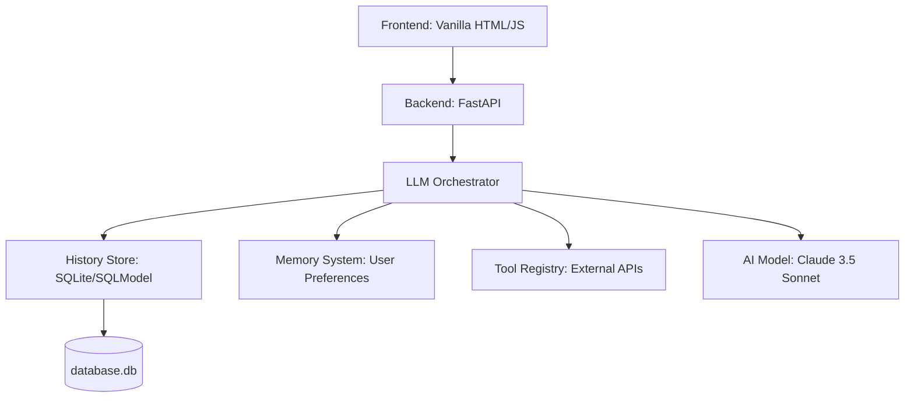

# System Architecture (Architecture Design)

## 1. 系統架構圖 (System Overview)
基於 FastAPI 與 HTML/JS 的串流架構。

## 2. 資料庫設計 (Database Schema)

### Table: `sessions`
*   `id`: UUID (PK)
*   `title`: string
*   `created_at`: timestamp

### Table: `messages`
*   `id`: UUID (PK)
*   `session_id`: UUID (FK)
*   `role`: enum (user, assistant, system, tool)
*   `content`: text
*   `metadata`: JSON (tokens, tools used)
*   `created_at`: timestamp

### Table: `user_memory`
*   `key`: string (PK)
*   `value`: text
*   `updated_at`: timestamp

## 3. 主要互動流程 (Interaction Flow)

### 對話流 (Dialogue Flow)
1. 前端通過 WebSocket 或 SSE 發送訊息。
2. 後端載入 `Session` 對話歷史。
3. Orchestrator 將歷史與當前訊息組裝成 Prompt。
4. 調用 LLM 後，如有 `tool_use` 則先執行工具並回填結果。
5. 推送最終回覆串流至前端。

## 4. 關鍵模組說明
*   **Orchestrator**: 負責調度歷史紀錄、系統提示詞、工具執行以及與 LLM 的通信。
*   **Tool Registry**: 提供一個裝飾器 (Decorator)，讓開發者能輕易註冊 Python 函數作為 AI 工具。
